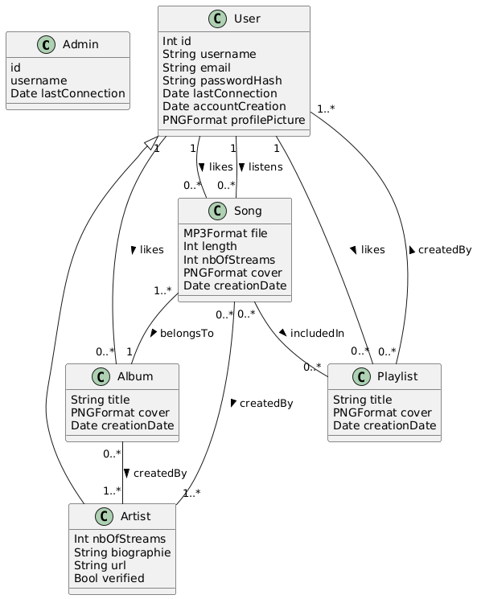

### Domain Model

[Schematic view](https://www.plantuml.com/plantuml/png/dLBToXCn4BtVfmXxARHOl2jI-YDgBzI5wWDaasaxc9-IJ9HIVNTdkma1knJzRahczCoSSsPs7Ka6IjOqoiWOnKPRTEBM286QVrA4uAG5VhwJ188vjFFEWIBqhldTbBP06EdUjtSaNF_bUA00qaP6-8Nk97hqfo0lPuIAfM2us7fln0y8U4JGFFGRgugtlsQpFBUetF6YWRgEgJOB0bQYgUM5st_we3_AU9xEKb2fb4-ETcm-mztd3-zzi9B49VWZ6kXGKGfGZBQBLh3LzlLy_geL1yzoIs7mEqIncc9iJ9_iSqfdvDLmyAUiAXK977FocaPyMDEdxarsFjZEUpFWJdIUF5HDgZoVewn4vLrmCOGUnhCJjZ2QMTH8FHZ-CtxrOZNIijF9PEYKIHhqtZsoy_ZyMIr72w2trvforBpL6nEIWNzECRR_ZsBr_cBHCk5HTpZlNwfhS3fPq_m1)



```
@startuml
class Admin {
  id
  username
  Date lastConnection
}

class Artist {
  Int nbOfStreams
  String biographie
  String url
  Bool verified
}
User <|-- Artist

class User {
  Int id
  String username
  String email
  String passwordHash
  Date lastConnection
  Date accountCreation
  PNGFormat profilePicture
}
User "1" -- "0..*" Song : likes >
User "1" -- "0..*" Album : likes >
User "1" -- "0..*" Playlist : likes >
User "1" -- "0..*" Song : listens >

class Song {
  MP3Format file
  Int length
  Int nbOfStreams
  PNGFormat cover
  Date creationDate
}
Song "1..*" -- "1" Album : belongsTo >
Song "0..*" -- "0..*" Playlist : includedIn >
Song "0..*" -- "1..*" Artist : createdBy >

class Album {
  String title
  PNGFormat cover
  Date creationDate
}
Album "0..*" -- "1..*" Artist : createdBy >

class Playlist {
  String title
  PNGFormat cover
  Date creationDate
}
Playlist "0..*" -- "1..*" User : createdBy >
@enduml
```
